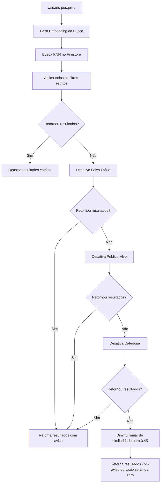

# Busca Inteligente com Fallback de Filtros e Faixa Etária

Documentação técnica do mecanismo de busca inteligente com fallback gradativo de filtros e correspondência de faixa etária baseado em regras.

## 1. Objetivo
Garantir que a busca semântica do TEA Guia Inteligente nunca retorne um estado frio ("Nenhum resultado correspondente") desnecessariamente quando filtros estritos (como categoria, público-alvo ou faixa etária) forem aplicados e nenhum documento corresponder a todos eles simultaneamente. Além disso, melhora a inteligência na correspondência de faixas etárias.

## 2. Arquitetura e Lógica

### Filtro de Faixa Etária Inteligente
A função `matchAge` faz a correspondência semântica e matemática de faixas etárias expressas textualmente. Ela:
* Extrai números da busca do usuário (ex: `"4 anos"` -> `4`).
* Identifica intervalos no artigo (ex: `"2 a 6 anos"`, `"3-8 anos"`) através de expressões regulares.
* Realiza a validação lógica (ex: se `4 >= 2` e `4 <= 6`, então é compatível).
* Trata termos universais (`"Todas as idades"`, `"qualquer"`, etc.) como correspondências automáticas (`true`).
* Utiliza busca de texto/substring como fallback se o formato for livre.

### Algoritmo de Fallback Gradativo
Caso a filtragem estrita resulte em zero documentos, a API aplica relaxamentos sucessivos até encontrar conteúdo relevante:
1. **Etapa 1:** Remove o filtro de faixa etária (`ageRange`).
2. **Etapa 2:** Remove também o filtro de público-alvo (`targetAudience`).
3. **Etapa 3:** Remove também a categoria (`categoryId`).
4. **Etapa 4:** Reduz a similaridade de cosseno mínima (`SIMILARITY_THRESHOLD`) de `0.65` para `0.45`.

## 3. Fluxo de Dados

## 4. Como Manter a Funcionalidade

* **Alterar o Limiar de Similaridade:** Os valores de corte estão definidos em `src/app/api/knowledge/search/route.ts` (`SIMILARITY_THRESHOLD = 0.65` para estrito, `0.45` no último fallback).
* **Adicionar novas regras de faixa etária:** Caso o padrão de cadastro de faixas etárias mude (ex: usando meses ou outros formatos), a função `matchAge` em `src/app/api/knowledge/search/route.ts` deve ser atualizada para dar suporte aos novos padrões Regex.
